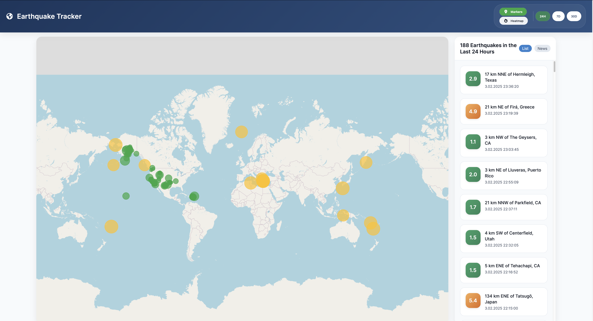

# 🌍 Earthquake Tracker

A real-time earthquake monitoring application that visualizes seismic activity worldwide using interactive maps and data visualization.

[](https://hits.seeyoufarm.com)


## ✨ Features

- **Real-time Data**: Updates automatically every 5 minutes with the latest earthquake data from USGS
- **Interactive Map Visualization**:
  - Marker view with color-coded magnitude indicators
  - Heatmap view for density visualization
- **Time-based Filtering**:
  - Last 24 hours
  - Last 7 days
  - Last 30 days
- **Detailed Information**:
  - Magnitude
  - Location
  - Timestamp
  - Additional details via USGS link
- **News Section**: Displays significant earthquake events
- **Responsive Design**: Works on desktop and mobile devices

## 🚀 Technologies Used

- HTML5
- CSS3
- JavaScript (ES6+)
- [Leaflet.js](https://leafletjs.com/) for map visualization
- [Leaflet.heat](https://github.com/Leaflet/Leaflet.heat) for heatmap functionality
- [USGS Earthquake API](https://earthquake.usgs.gov/fdsnws/event/1/) for real-time data

## 📋 Prerequisites

- Modern web browser (Chrome, Firefox, Safari, Edge)
- Internet connection for real-time data updates

## 💻 Local Development

1. Clone the repository:
   ```bash
   git clone https://github.com/mehmetkahya0/earthquake-tracker.git
   ```

2. Navigate to the project directory:
   ```bash
   cd earthquake-tracker
   ```

3. Open the project:
   - Use a local development server (recommended)
   - Or simply open `index.html` in your browser

## 🔧 Configuration

No additional configuration is required. The application uses public APIs and CDN-hosted dependencies.

## 📱 Browser Support

- Chrome (latest)
- Firefox (latest)
- Safari (latest)
- Edge (latest)

## 🤝 Contributing

Contributions are welcome! Please feel free to submit a Pull Request.

1. Fork the repository
2. Create your feature branch (`git checkout -b feature/AmazingFeature`)
3. Commit your changes (`git commit -m 'Add some AmazingFeature'`)
4. Push to the branch (`git push origin feature/AmazingFeature`)
5. Open a Pull Request

## 📄 License

This project is licensed under the MIT License - see the [LICENSE](LICENSE) file for details.

## 👏 Acknowledgments

- [USGS](https://www.usgs.gov/) for providing earthquake data
- [OpenStreetMap](https://www.openstreetmap.org/) for map tiles
- [Leaflet](https://leafletjs.com/) for the mapping library

## 📞 Contact

[@mehmetkahya0](https://github.com/mehmetkahya0)

Project Link: [https://github.com/mehmetkahya0/earthquake-tracker](https://github.com/mehmetkahya0/earthquake-tracker)

## 🐛 Known Issues

- Heatmap may take longer to load with large datasets
- Some older browsers might not support all features

---

Made with ❤️ by [Mehmet Kahya](https://github.com/mehmetkahya0)
